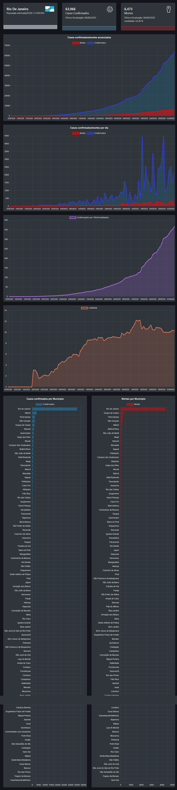

[](https://app.netlify.com/sites/frontcovid/deploys)


# FrontCovid 

Sistema de monitoramento da epidemia de Covi-19 no brasil e no mundo

## Descrição

Este sistema tem por objetivo agregar dados de fontes que disponibilizam dados sobre a covid-19
e mostrar através de gráficos a situação no Brasil e no mundo


## Site

[FrontCovid](https://frontcovid.netlify.app)

## Updates
-24/09/2020
 -O Sistema apresenta algumas falhas pois os servidores de dados estão limitando o numero de conexões
 -A parte sobre o mundo teve a parte de países com alguns retirados, em breve será refeito 

Telas

- Tela principal com menu


-Tela principal mostarndo dados do Brasil e dos estados


-Exemplo de tela do estado com detalhes



### Requisitos

Este sistema foi testado nos navegadores mais atualizados como Firefox e chrome

### Instalação

```
-Clonar ou baixar o repositorio do github
```
```
-Dentro da pasta do projeto executar:
npm install
```
```
-Em seguida para executar:
npm start
```

## Bugs

O sistema passou por alguns testes mais podem haver bugs na interface, ainda por 
usar dados de terceiros ele podem estar offline ou desatualizados, quando isso
acontece tentarei corrigir o problema assim que possível

## Softwares e Tecnologias Usados


* [ReactJS](https://pt-br.reactjs.org/) - Biblioteca JavaScript para criar interfaces de usuário
* [ChartJS](https://www.chartjs.org/) - Gráficos para javascript
* [Leaflet](https://leafletjs.com/) - Biblioteca Javascript para mapas interativos
* [CoreUI](https://coreui.io/react/) - Template administrativo para react 


## Versão

A versão colocada aqui é a usada durante o desenvolvimento na versão 1.0

## Sobre o Projeto

* Este é meu primeiro projeto usando o reactjs
* Consegui aprender bastante sobre o funcionamento do react como Hooks,useEffect 
e uma programação mas funcional
* Descobrir e trabalhar com dados de terceiros, entender como funcionam suas APIs é realmente
desafiador
* Encontrar dados sobre a covid-19 tambem não é facil.
* Utilizei um template pronto pois resolvi focar mais no funciomento do sistema do que na parte
estlização, mais mesmo assim fiz alguns ajustes para uso pessoal


## Futuro

* Usar uma interface própria 
* Alteração na parte grafica de dados, comforme forem disponibilizados mais dados sobre a covid-19

## Referências

As seguintes referências foram usadas no densenvolvimento desse projeto

* [Build a COVID-19 Tracker Application - React JS Project (Hooks, Material UI, Charts js) - JavaScript Mastery] (https://www.youtube.com/watch?v=khJlrj3Y6Ls&t=187s)

## Fontes de dados sobre a Covid-19

* [Boletins informativos e casos do coronavírus por município por dia )] (https://brasil.io/dataset/covid19/caso/)
* [COVID-19 global data (from JHU CSSE for now) as-a-service - mathdroid)] (https://github.com/mathdroid/covid-19-api)
* [A free API for data on the Coronavirus - Kyle Redelinghuys )] (https://covid19api.com/)
* [Free COVID-19 API )] (https://covid19-api.org/)


## Autor

* **Eliederson Linhares**  - (https://github.com/EliedersonLinhares)
*   Email: eliederson210@outlook.com


## Licença

Este projeto estará sobre a licensa MIT.
